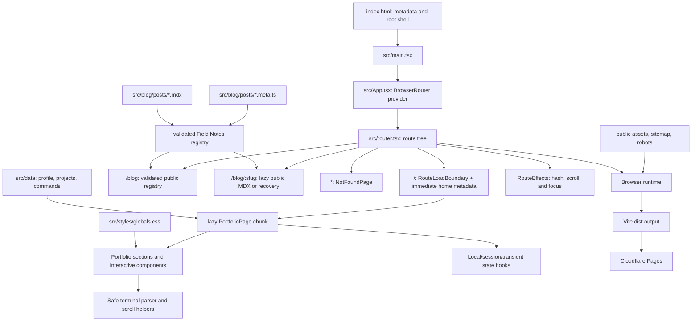
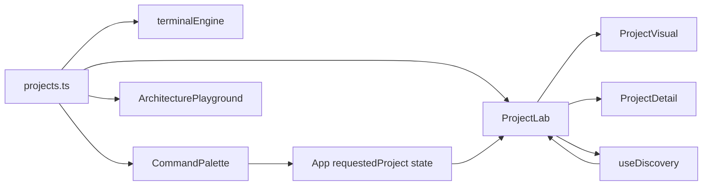
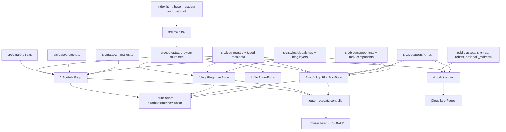
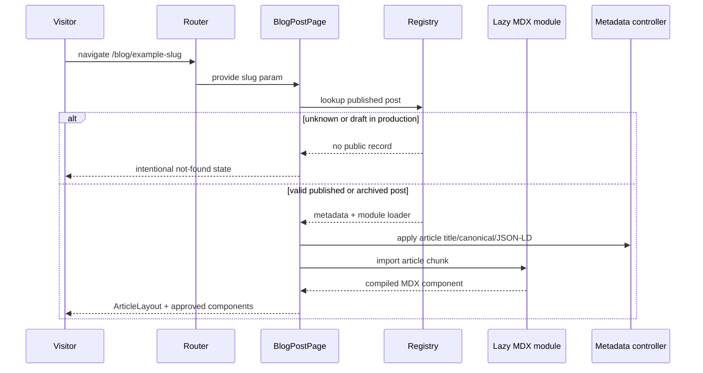
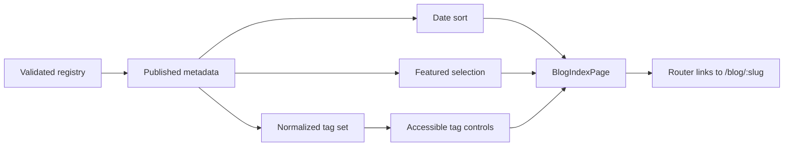

# ATRX Portfolio Architecture

This is the durable technical map for the ATRX portfolio. It records the structure, state, data
ownership, interactions, verification boundaries, and deployment model. Update it whenever those areas
materially change.

## System Summary

The portfolio is a static, route-based React application built by Vite and deployed to Cloudflare Pages.
BrowserRouter owns `/`, `/blog`, `/blog/:slug`, and the application not-found route. The existing
interactive portfolio remains the `/` route. Field Notes now has a build-time MDX compiler, validated
typed registry, paired eager metadata and lazy article modules, draft/publication boundaries, and a
complete editorial index and long-form article shell. There is no application server, database, authentication layer,
analytics service, runtime MDX evaluator, or arbitrary remote execution path.



## Technology Stack

| Layer | Technology | Responsibility |
| --- | --- | --- |
| Build | Vite 6 | Development server and static production bundle |
| UI runtime | React 18 | Component rendering and interaction state |
| Routing | React Router DOM 7 | Browser-history routes, links, parameters, Back/Forward behavior, and not-found states |
| Article build | `@mdx-js/rollup` + `remark-gfm` | Compile trusted local MDX and semantic GFM tables before React transformation |
| Article discovery | Vite `import.meta.glob` | Load small typed metadata eagerly and article bodies as separate lazy chunks |
| Language | TypeScript 5.7 strict mode | Typed data, components, hooks, and terminal engine |
| Styling | Tailwind build pipeline plus custom global CSS | Tokens, layout, responsive behavior, motion styling, and visual system |
| Motion | GSAP, `@gsap/react`, ScrollTrigger, Framer Motion | Purposeful reveal, flagship pinning, scroll-linked behavior, and reduced-motion-aware component animation |
| Icons | Lucide React | Accessible interface icons |
| Unit tests | Vitest, React Testing Library, jsdom | Hooks, parser, components, filters, architecture, terminal, and contact behavior |
| End-to-end | Playwright | Desktop/mobile workflows, layout contracts, interaction behavior, and SEO endpoints |
| Hosting | Cloudflare Pages | Static `dist/` deployment |

## Entry and Composition

1. `index.html` provides the root element, homepage fallback metadata, crawler controls, responsive
   image preloads, and the fallback homepage JSON-LD graph.
2. `src/main.tsx` mounts `<App />` into `#root` under `React.StrictMode` and imports the global stylesheet.
3. `src/App.tsx` mounts `BrowserRouter`, `RouteEffects`, and the route tree from `src/router.tsx`.
4. `src/router.tsx` applies homepage metadata immediately, then resolves `PortfolioPage` through a
   route-level lazy boundary. `src/pages/PortfolioPage.tsx` owns the homepage composition,
   portfolio-only GSAP/Motion dependencies, and cross-section state.
5. `BlogIndexPage`, `BlogPostPage`, and `NotFoundPage` use one shared route shell with the same
   route-aware header and footer. The index reads only public registry records and derives featured,
   tag, count, and archive presentation from them. The current test fixture remains a draft and therefore
   leaves the deployed visible count at zero.
6. `src/blog/registry.ts` validates eager metadata companions, pairs them with lazy MDX modules, and
   exposes the single public lookup/sorting/filtering boundary.
7. `PageMetadata` applies typed route metadata from `src/lib/pageMetadata.ts`, updates existing head
   elements in place, removes stale profile/article state, and owns the route-aware visibility title.
8. `RouteEffects` resolves cross-route homepage fragments and headings through a bounded mount observer,
   honors reduced motion, ignores temporary loading headings, focuses deliberate navigation targets,
   and leaves POP restoration to browser history.
9. Vite emits the static `dist/` artifact consumed by Cloudflare Pages. The shared entry owns the route
   shell, Field Notes, recovery, metadata, and registry metadata; the lazy portfolio chunk owns its
   interactive systems; each article body remains a separate lazy chunk.

## Runtime Component Map

| Component | Responsibility |
| --- | --- |
| `App.tsx` / `router.tsx` | BrowserRouter provider and public route declaration |
| `PortfolioPage.tsx` | Existing homepage composition and portfolio-only state ownership |
| `RouteLoadBoundary.tsx` | Stable one-main loading shell, quiet chunk-failure recovery, and no temporary route-focus claim |
| `RoutePageShell.tsx` | Shared header, one main landmark, and footer for non-portfolio routes |
| `BlogIndexPage.tsx` / `BlogIndex.tsx` | Registry-derived index composition, local tag filtering, featured selection, chronological rows, and honest empty states |
| `BlogPostPage.tsx` / `NotFoundPage.tsx` | Public slug lookup, explicit development-only preview lookup, lazy article rendering, draft rejection, and deliberate route recovery |
| `PageMetadata.tsx` / `lib/pageMetadata.ts` | Typed route metadata builders, canonical normalization, deterministic title/meta/canonical/JSON-LD synchronization, noindex cleanup, and visibility-title restoration |
| `blog/registry.ts` / `validation.ts` | Metadata/body pairing, invariant enforcement, sorting, public filtering, lookup, and bounded lazy-load errors |
| `BlogIndexHeader.tsx` / `FeaturedNote.tsx` / `TagFilter.tsx` / `NoteArchiveRow.tsx` | Bounded editorial index primitives; Magic Tab supplies manual activation and roving focus for the contained tag rail |
| `ArticleHeader.tsx` / `ArticleLayout.tsx` / `ArticleFooter.tsx` | Shared 74ch article hierarchy, state notices, dates, associations, prose rail, and final navigation |
| `ArticleLoadBoundary.tsx` / `CodeBlock.tsx` / `blog/mdx-components.tsx` | Reserved loading and safe failure recovery, semantic Markdown mapping, safe external links, copy feedback, and contained code/table overflow |
| `RouteEffects.tsx` / `routeNavigation.ts` | Tested mount-aware route fragment/heading resolution, reduced-motion scroll behavior, and focus transfer |
| `Header.tsx` | Persistent route-aware system rail, desktop/mobile navigation, availability, optional portfolio controls, and GitHub |
| `Hero.tsx` | Identity, role/value statement, CTAs, responsive artwork, visitor modes, boot copy, current-build signal |
| `VisitorModeSwitch.tsx` | Controlled Recruiter/Developer/Chaos adapter shared by hero and mobile navigation |
| `godui/mask-button.tsx` | Semantic button/link primitives with sprite-mask hover, focus, keyboard, and touch feedback |
| `godui/magic-tab.tsx` | Controlled/uncontrolled tab primitive with roving focus, manual activation, raised selection layers, and off-screen rainbow pausing |
| `godui/orbiting-circles.tsx` | Reusable counter-rotating orbital tracks with fixed geometry, counter-rotated children, and a static reduced-motion fallback |
| `godui/agent-flow.tsx` | Reusable measured-node workflow canvas with fixed or draggable coordinates, SVG edge packets, autoplay sequencing, and reduced-motion resolution |
| `Flagship.tsx` | NeuraLoc-Core narrative, pinned desktop title, runtime visual, architecture strip, proof and roadmap |
| `ProjectLab.tsx` | Project filters, accordion state, mobile tap behavior, discovery, and detail-dialog coordination |
| `ProjectVisual.tsx` | Deterministic project-specific visual fragments for six visual types, including void.chat's layered edge architecture orbit |
| `ProjectDetail.tsx` | Accessible project case-study dialog with proof points, stack, repository, and constraints |
| `ArchitecturePlayground.tsx` | Project tabs, keyboard node navigation, pinned responsibility explanation |
| `PortfolioTerminal.tsx` | Fixed-height terminal UI, input history, completion, safe action dispatch, internal output scrolling |
| `CommandPalette.tsx` | Section navigation, Field Notes navigation, project opening, visitor-mode changes, terminal access, GitHub, and email copy |
| `ExperimentRack.tsx` | Smaller public and unlinked experiment record |
| `CapabilityMap.tsx` | Capabilities grouped by engineering purpose |
| `FieldNotes.tsx` | About identity, operating-principle carousel, responsive portrait ordering |
| `Contact.tsx` | Email, GitHub, and copy-email feedback |
| `Footer.tsx` | Closing identity and navigation context |

The bundled mask sprite sheets live in `src/components/assets/` and are emitted as fingerprinted Vite
assets. They are presentation-only: navigation remains a native anchor, copy actions remain native
buttons, and no mask interaction changes routing or data ownership. Magic Tab has no runtime dependency
beyond React; `VisitorModeSwitch` supplies the controlled value while `useVisitorMode` remains the sole
owner of persisted mode state. Field Notes reuses the same primitive with its rainbow layer disabled,
an explicit controlled panel relationship, and archive-specific square styling. The void.chat identity composes two `OrbitingCircles` tracks around a
static room core; the nodes communicate Firebase identity, Cloudflare edge execution, Durable Object
room ownership, WebSocket delivery, and D1 persistence without adding runtime state or network work.
The Aveline identity composes the bundled `AgentFlow` as a fixed, non-pannable workflow. Message ingress
branches into mood context and Upstash memory, converges on resilient Groq inference, and exits through
a state-aware reply. `ProjectLab` selects a linear Reply position only for an expanded desktop accordion;
mobile accordions and `ProjectDetail` retain the dropped Reply position. Layout changes remount the flow,
and fit-to-view observes its viewport through the accordion's flex transition so it settles against the
final available width. The linear variant may enlarge to a bounded 1.28x to fill a wide canvas, while
stacked variants retain the component's 1:1 maximum. The collapsed card does
not run the autoplay sequence.

## Data Ownership

### Canonical local data

- `src/data/profile.ts` owns public identity, role, contact routes, headline, availability, principles,
  capability groups, experiments, canonical origin, social-image values, stable site dates, and Field
  Notes collection metadata.
- `src/data/projects.ts` owns all featured project claims, categories, technologies, maturity, public
  links, proof points, constraints, architecture nodes, roadmap text, and visual type.
- `src/data/commands.ts` owns the terminal command catalog and help descriptions.
- `src/types.ts` defines `VisitorMode`, `ProjectStatus`, `ArchitectureNode`, and `Project`.

Components may choose presentation and interaction behavior, but durable profile or project claims
should not be duplicated into component files without a strong reason.

### Field Notes data flow

- `src/blog/posts/<slug>.meta.ts` is the canonical eager metadata source and satisfies `BlogPostMeta`.
- `src/blog/posts/<slug>.mdx` re-exports the same metadata and contains the trusted local article body.
- `registry.ts` requires exact basename companions, validates filename/slug agreement and all metadata
  invariants once, rejects duplicates, and exposes public records in deterministic date order.
- Public helpers include `published` and explicitly marked `archived` notes; they exclude `draft` notes.
- Article lookup returns the validated record and a bounded lazy loader. It verifies the MDX module's
  re-exported metadata against the canonical eager value before rendering.
- `preview.ts` admits draft lookup only when both development mode and the explicit `preview=draft`
  query are present. The production registry independently refuses draft lookup even if those flags are
  forced, preserving two boundaries.
- The paired-file design avoids a static named import from the MDX module, which would collapse the
  dynamic article import into the entry chunk under Rollup.

### Project data flow



## State and Persistence

| State | Owner | Persistence | Notes |
| --- | --- | --- | --- |
| Visitor mode | `useVisitorMode` -> `useLocalStorage` | `localStorage: atrx-visitor-mode` | Validated against recruiter/developer/chaos |
| Sound mute | `useSignalAudio` -> `useLocalStorage` | `localStorage: atrx-muted` | Defaults muted; audio is user initiated |
| Discovered systems | `useDiscovery` | `sessionStorage: atrx-discovered-systems` | Never gates content |
| Signal mode | `useSignalMode` | transient memory/timer | Harmless, dismissible, and keyboard escapable |
| Command palette | `App` | transient React state | Dialog opens from header or Ctrl/Cmd+K |
| Requested project | `App` -> `ProjectLab` | transient React state | Lets palette select a project and scroll to the lab |
| Copy feedback | `App` | transient React state | Clipboard API with selection-based fallback |
| Terminal history/output | `PortfolioTerminal` | component memory | Fixed parser; no arbitrary evaluation |
| Project expansion/filter | `ProjectLab` | component memory | Mobile opens only by title tap; desktop uses accordion interaction |
| Architecture selection | `ArchitecturePlayground` and flagship | component memory | Keyboard and pointer accessible |
| Blog tag filter | `BlogIndex` | component memory | Controlled Magic Tab selection; registry records remain immutable |
| Draft preview | `BlogPostPage` URL query | transient route state | Development-only and explicit; production registry still rejects drafts |
| Article code-copy feedback | `CodeBlock` | transient component timer | Clipboard API with selection-based fallback and a polite live status |

## Key Interaction Flows

### Command palette

`Header` or keyboard shortcut -> `App.paletteOpen` -> `CommandPalette` -> section scroll, project request,
mode change, terminal focus, GitHub open, or email copy.

### Project inspection

Filter or palette request -> `ProjectLab` -> expansion -> `ProjectVisual` -> explicit `Inspect system`
action -> `ProjectDetail` dialog -> allowlisted repository link.

On mobile, tapping the title only expands or collapses the card. It never opens the detail dialog.

### Safe terminal

User input -> `PortfolioTerminal` -> `executeTerminalCommand` in `src/lib/terminalEngine.ts` -> fixed
`TerminalResult` -> rendered lines and optional allowlisted action.

The parser uses normalized exact commands. It contains no `eval`, interpolation, process access, arbitrary
network request, or shell bridge.

### Discovery

Project exploration -> `discover(slug)` -> unique session list -> header count and short system log.
Discovery is a retention signal, not an authorization or content gate.

### Sound

Explicit unmute -> explicit play action -> short WebAudio oscillator sequence -> context closes.
There is no autoplay.

## Styling and Responsive Architecture

- `src/styles/globals.css` owns tokens, typography, layout, component styling, motion fallbacks, dialog
  behavior, and responsive breakpoints.
- Major responsive thresholds are 1180 px, 900 px, and the mobile rules near 640 px.
- Desktop uses the pinned flagship narrative and vertical project accordion.
- Mobile disables pointer-follow assumptions, uses the wide hero artwork, stacks visitor modes
  horizontally, presents About copy before the portrait, and uses tap-controlled project cards.
- Visitor modes use the bundled Magic Tab interaction model with sharp ATRX geometry, manual arrow-key
  focus, Enter/Space activation, and signal-blue/red selected-edge animation that pauses off screen.
- Aveline's Agent Flow uses stable layout-specific canvas coordinates, disabled dragging/panning, a
  responsive fit-to-view frame, matched 12 px node/trace radii, a fine-pointer hover lift, and immediate
  final-state resolution under reduced motion. Only the expanded desktop accordion selects the linear
  Reply route; the dialog and mobile layouts select the stacked route.
- `prefers-reduced-motion` must bypass nonessential motion and preserve all content and interaction.
- Fixed-format visuals use stable grids, dimensions, containment, and overflow rules to prevent layout shift.

## Static Assets and SEO

- `public/atrx-portrait.jpg` is the square primary identity artwork.
- `public/atrx-wide.jpg` is the mobile hero and social-sharing artwork.
- `public/atrx-avatar.png` is the favicon/avatar asset.
- `public/atrx-mark.png` is a retained ATRX mark asset.
- `public/robots.txt` allows crawling and points to the canonical sitemap.
- `public/sitemap.xml` contains `/`, `/blog`, and every indexable registry route. Its source test compares
  exact URLs and stable `lastmod` values against the validated published/archived registry, so drafts
  cannot enter and new public notes cannot be omitted silently.
- `index.html` owns the raw SPA-shell homepage fallback: canonical, title, description,
  robots/googlebot controls, Open Graph, Twitter, identity links, responsive preloads, and homepage
  JSON-LD. It does not claim to prerender deep-route metadata.
- `src/lib/pageMetadata.ts` derives hydrated metadata for home, collection, public/archived article,
  draft preview, and recovery states from `src/data/profile.ts` plus validated article metadata.
- `PageMetadata` updates the marked JSON-LD script and managed head fields without duplication. Draft
  previews and recovery routes remove canonical, social, profile/article, and structured-data remnants
  and use `noindex, nofollow`.
- Cloudflare currently serves one BrowserRouter shell. A direct raw `/blog` response therefore contains
  the homepage fallback until JavaScript hydrates; browser-rendered metadata is route-specific. This is
  intentionally tested and is not equivalent to prerendering or static generation.

## Build and Deployment

```text
source
  -> pnpm build
  -> tsc -b
  -> vite build
  -> dist/
  -> Cloudflare Pages
  -> https://atrx07.pages.dev/
```

- `wrangler.jsonc` names the Pages project and declares `./dist`.
- Core rendering does not depend on a server or runtime secret.
- The Cloudflare project must publish `dist`, not the repository root.
- A root deployment can return HTTP 200 while failing to run uncompiled `/src/main.tsx`; live checks
  must verify the expected title or hashed bundle, not status alone.

## Verification Architecture

### Unit/component

- `src/lib/terminalEngine.test.ts`
- `src/hooks/useVisitorMode.test.tsx`
- `src/components/ArchitecturePlayground.test.tsx`
- `src/components/Contact.test.tsx`
- `src/components/godui/mask-button.test.tsx`
- `src/components/godui/magic-tab.test.tsx`
- `src/components/godui/orbiting-circles.test.tsx`
- `src/components/godui/agent-flow.test.tsx`
- `src/components/PortfolioTerminal.test.tsx`
- `src/components/ProjectLab.test.tsx`
- `src/components/ProjectVisual.test.tsx`
- `src/blog/validation.test.ts`
- `src/blog/registry.test.ts`
- `src/blog/preview.test.ts`
- `src/blog/sitemap.test.ts`
- `src/lib/pageMetadata.test.ts`
- `src/blog/components/BlogIndex.test.tsx`
- `src/blog/components/ArticleLayout.test.tsx`
- `src/blog/mdx-components.test.tsx`
- `src/router.test.tsx`

Vitest is deliberately scoped to `src/**/*.test.{ts,tsx}` and explicitly excludes the ignored
`.pnpm-store/**` workspace cache. This keeps `pnpm.cmd test` limited to the canonical application
suite even when local QA mirrors or package-store copies exist beneath the repository root.

### End-to-end

`e2e/portfolio.spec.ts` covers the command-palette-to-project-to-terminal flow, mobile navigation,
mask assignment and touch feedback, Magic Tab selection/focus/edge motion, reduced-motion fallback,
project filtering, architecture keyboard behavior, operating principles, copy-email feedback, mobile
containment, flagship geometry, project visual geometry, dialog title fit, terminal containment, mobile
tap-only project behavior, void.chat orbit/card/dialog containment, canonical metadata, structured data,
sitemap, robots, hydrated route metadata replacement/cleanup, the explicit raw-SPA fallback, and
Aveline's desktop-linear/mobile-and-dialog-stacked flow contracts.
`e2e/routes.spec.ts` covers cross-route Field Notes navigation, browser history, direct development
preview, semantic article primitives, code/table containment, unpublished recovery, and reduced-motion
route behavior across desktop and mobile projects.

The Stage E build isolates the complete interactive portfolio behind one measured route boundary. The
shared entry is 233.14 kB minified (75.81 kB gzip), the portfolio route chunk is 309.86 kB (109.22 kB
gzip), and the draft fixture body remains isolated in a 1.96 kB (0.83 kB gzip) article chunk. Direct
`/blog` and recovery visits request only the shared entry; `/` adds the portfolio chunk. Source-map
inspection confirms GSAP, Framer Motion, Motion DOM, and portfolio section modules are absent from the
shared entry. The loading shell does not delay ready content or receive route focus, while a bounded
mutation observer transfers focus once the real route target mounts.

### Required pre-push loop

```powershell
pnpm.cmd lint
pnpm.cmd test
pnpm.cmd build
pnpm.cmd test:e2e
```

Also inspect representative desktop and 360 px mobile renders, check console warnings/errors, verify no
horizontal overflow, and confirm the live Cloudflare artifact after pushing.

## Security and Privacy Boundaries

- Public links are allowlisted in canonical data or fixed commands.
- The terminal cannot execute arbitrary input.
- No analytics or trackers are installed.
- No client token or environment secret is required.
- Private repositories receive no implementation detail or fabricated link.
- Public claims must remain grounded in supplied facts or public repository documentation.
- `STATUS.md` and `.agents/` are private ignored control material. `AGENTS.md`, `PROJECT.md`,
  `DESIGN.md`, `ARCHITECTURE.md`, and `NEXT_STEP.md` are versioned governance documents and must
  remain free of secrets, private repository contents, local paths, and personal data.

## Architecture Change Triggers

Update this document in the same work session when any of these change:

- entry points, build tooling, framework, major dependency, or hosting target
- component boundaries or section ownership
- typed profile/project/command data ownership
- local storage, session storage, terminal, sound, discovery, or cross-component state
- routing, page structure, dialogs, architecture interaction, or mobile project behavior
- asset strategy, metadata ownership, sitemap, robots, or deployment output
- unit/E2E coverage boundaries or the required verification loop


---

## Field Notes Architecture Extension

### Delivery status and superseding rule

Stages A through E are implemented: the application is route based, the portfolio is preserved at `/`,
shared navigation is route aware, route focus/hash behavior is tested, invalid routes are deliberate,
and the Field Notes content system compiles trusted local MDX through a validated typed registry with
true lazy article chunks. The index/article presentation, typed hydrated metadata lifecycle, JSON-LD,
test-locked sitemap, route-specific portfolio payload, and mount-aware focus behavior described below
are delivered. Static prerendering remains a possible future extension, not a current capability.
Do not leave contradictory “planned” and “current” architecture after launch.

The implementation must not rewrite project presentation into a generic data-only system. Existing
project-specific visuals and interactions remain owned by the portfolio route.

### Target system summary



### Target technology additions

| Layer | Technology / mechanism | Responsibility |
| --- | --- | --- |
| Routing | `react-router-dom` | Browser-history routes, links, parameters, not-found state, Back/Forward behavior |
| Article source | MDX | Versioned prose with approved React components |
| MDX build | `@mdx-js/rollup` | Compile local `.mdx` modules through Vite at build time |
| Article discovery | Vite `import.meta.glob` | Discover local article modules and/or metadata without manual component imports |
| Metadata | Typed route metadata controller | Title, description, canonical, social tags, and JSON-LD replacement per route |
| Publication validation | TypeScript helper + tests | Validate slugs, status, dates, tags, module presence, and duplicates |
| Route hosting | Cloudflare Pages SPA fallback | Serve the application shell for valid deep navigation requests when no static route artifact exists |

Do not add a server, database, authentication layer, runtime MDX evaluator, or secret-bearing API for the
initial implementation.

### Target repository structure

Recommended ownership map:

```text
src/
  main.tsx
  router.tsx

  pages/
    PortfolioPage.tsx
    BlogIndexPage.tsx
    BlogPostPage.tsx
    NotFoundPage.tsx

  layouts/
    SiteLayout.tsx                 # only if shared route shell is extracted

  blog/
    types.ts                       # BlogPostMeta, status, module types
    registry.ts                    # discovery, filtering, sorting, lookup
    validation.ts                  # invariant checks
    metadata.ts                    # blog/article metadata builders
    mdx-components.tsx             # approved MDX component mapping

    components/
      ArticleLayout.tsx
      ArticleHeader.tsx
      ArticleFooter.tsx
      ArticleTableOfContents.tsx
      NoteCallout.tsx
      CodeBlock.tsx
      Figure.tsx
      MetricPanel.tsx
      ArchitectureFigure.tsx
      ComparisonTable.tsx
      RelatedNotes.tsx

    posts/
      <stable-slug>.meta.ts         # canonical eager metadata
      <stable-slug>.mdx

  components/
    Header.tsx                     # refactored to be route-aware
    Footer.tsx                     # shared when practical
    ...existing portfolio components

  lib/
    routeScroll.ts                 # route/hash scroll and focus behavior
    pageMetadata.ts                # generic head mutation lifecycle, if separated

public/
  sitemap.xml                      # or generated equivalent
  robots.txt
  _redirects                      # only when explicitly required and documented
```

The implementation may use different filenames when the existing code makes another boundary cleaner,
but avoid:

- putting the entire blog in `App.tsx`;
- embedding article metadata inside card markup;
- duplicating the header/footer into unrelated blog copies;
- placing every MDX component in one unbounded file;
- manually maintaining several divergent arrays of the same post metadata;
- importing all article bodies into the homepage bundle.

### Entry and route composition

Target flow:

1. `index.html` supplies base fallback metadata and the root element.
2. `src/main.tsx` mounts the route provider under `React.StrictMode` and imports global styles.
3. `src/router.tsx` declares all public routes.
4. The existing content of `src/App.tsx` moves into `PortfolioPage.tsx` or an equivalent route component.
5. `App.tsx` may become the router/shell entry or be removed only after all imports/tests are updated.
6. `BlogIndexPage.tsx` reads published metadata from the canonical registry.
7. `BlogPostPage.tsx` resolves `:slug`, rejects hidden drafts, lazy-loads the article module, applies route
   metadata, and renders the approved MDX component mapping.
8. `NotFoundPage.tsx` provides an intentional route recovery path.
9. The shared header uses router links for cross-route navigation and route-plus-fragment links for
   homepage sections.
10. The footer remains recognizably shared across routes.

### Route table

| Route | Owner | Data | Rendering behavior |
| --- | --- | --- | --- |
| `/` | `PortfolioPage` | profile, projects, commands, existing hooks | Current interactive portfolio and section anchors |
| `/blog` | `BlogIndexPage` | published article metadata | Featured note, tags, chronological archive |
| `/blog/:slug` | `BlogPostPage` | validated metadata + lazy MDX module | Article layout or intentional not-found |
| `*` | `NotFoundPage` | route location only | Recovery links to home and Field Notes |

Optional future routes such as `/blog/tag/:tag`, `/blog/series/:series`, or feeds are not part of the first
implementation.

### Route-aware shell and state ownership

The current header expects portfolio-specific state such as discovery count, sound, visitor mode, and
command palette actions. Refactor without duplicating the entire shell.

Recommended ownership:

| Concern | Owner after routing | Route behavior |
| --- | --- | --- |
| Visitor mode persistence | existing `useVisitorMode` owner | Preserved globally; article prose does not change facts or density by mode |
| Sound mute | existing `useSignalAudio` owner or route shell | Remains user-controlled; blog never autoplays sound |
| Discovery count | `PortfolioPage` | Visible only where meaningful; do not show misleading `0/6 found` on direct article arrival |
| Project request | `PortfolioPage` | Portfolio-only |
| Terminal focus/action | `PortfolioPage` / command palette | Blog navigation may offer a route back to terminal, not mount terminal inside articles |
| Command palette open state | shared shell when practical | May include Home, Field Notes, and article navigation without losing existing commands |
| Blog tag filter | `BlogIndexPage` | URL query parameter optional; otherwise local component state |
| Article module state | `BlogPostPage` | Route-bound lazy-load state and error boundary |
| Page metadata | route metadata controller | Replaced on every route transition and cleaned up on exit |
| Route scroll/focus | shared route utility | Top/focus behavior for new pages; hash behavior for homepage sections |

Visitor modes must not produce three different versions of an article's factual content. At most, they
may influence small surrounding labels or optional presentation in a future explicitly designed feature.

### Canonical blog data types

```ts
export type BlogPostStatus = "draft" | "published" | "archived";

export type BlogPostMeta = {
  slug: string;
  title: string;
  description: string;
  publishedAt: string;
  updatedAt?: string;
  status: BlogPostStatus;
  tags: string[];
  series?: string;
  featured?: boolean;
  cover?: {
    src: string;
    alt: string;
  };
  repositoryUrl?: string;
  projectSlug?: string;
  canonicalUrl?: string;
};

export type BlogPostModule = {
  default: React.ComponentType;
  meta: BlogPostMeta;
};
```

If metadata is represented differently, preserve equivalent guarantees and document the source of truth.

### Registry architecture

The registry is the single runtime source for index cards, article lookup, related notes, route metadata,
and publication state.

Implemented split:

```ts
// Metadata can be discovered eagerly because the index needs it.
const metaModules = import.meta.glob("./posts/*.meta.ts", {
  eager: true,
  import: "meta",
});

// Article bodies remain lazy to avoid loading every note into the initial route.
const postModules = import.meta.glob<BlogPostModule>("./posts/*.mdx");
```

Every MDX module re-exports `meta` from its exact basename companion. Keeping the canonical eager value
in `.meta.ts` prevents Rollup's static metadata import from pulling the same MDX body into the entry
chunk. The registry validates the eager value and verifies the lazy re-export again at load time. It
exposes narrow helpers such as:

```ts
getPublishedPosts()
getFeaturedPost()
getPostBySlug(slug)
getPostsByTag(tag)
getRelatedPosts(meta)
getAllPublishedTags()
```

Registry invariants:

- normalize and validate metadata once;
- sort by publication date descending;
- reject duplicate slugs;
- keep stable deterministic output;
- exclude drafts from production-facing helpers;
- retain archived notes with an archive marker;
- never derive public routes from filenames alone when an explicit slug is supplied;
- never accept a route slug that maps to one module while metadata claims another slug;
- return typed errors or `undefined` for unknown entries rather than throwing raw import errors into UI.

### Article-loading flow



Use a route-level loading state that reserves layout space and does not flash the homepage. Use an error
boundary around article loading and render a clear recovery state without exposing stack traces.

### MDX compilation and component boundary

Configure MDX before the React plugin in Vite when required by the integration. Preserve ESM-only package
requirements and the repository's Node/pnpm baseline.

The MDX component map owns semantic presentation for:

- headings and optional heading anchors;
- paragraphs and lead copy;
- links and allowlisted internal project links;
- code/pre blocks;
- tables;
- blockquotes;
- figures and captions;
- horizontal rules;
- custom callouts, metrics, diagrams, disclosures, and related-note blocks.

Security boundary:

- MDX is trusted local source committed by the project owner, not user input;
- do not fetch and evaluate remote MDX;
- do not pass URL/query content into executable MDX expressions;
- do not expose application secrets or private local files through imports;
- sanitize any embedded raw HTML strategy or avoid raw HTML entirely;
- external links opened in a new context use safe `rel` values;
- code blocks are inert text.

### Metadata ownership and lifecycle

Base metadata remains in `index.html` as a safe fallback. Route-specific metadata is owned by
`src/lib/pageMetadata.ts` and the `PageMetadata` controller with deterministic cleanup.

Required route fields:

| Route | Required metadata |
| --- | --- |
| `/` | existing portfolio title, description, canonical, profile/site structured data |
| `/blog` | Field Notes title, description, canonical, collection/blog structured data when accurate |
| `/blog/:slug` | article title, description, canonical, OG article fields, dates, image when valid, BlogPosting/TechArticle JSON-LD |
| not found | clear title, no false article canonical, normally `noindex` if implemented intentionally |

The controller:

- update existing tags instead of endlessly appending duplicates;
- remove article-only tags and JSON-LD when leaving an article;
- restore homepage metadata after route navigation;
- normalize the canonical origin from the production profile metadata;
- escape/serialize JSON-LD safely;
- avoid claiming route-specific HTML is statically served unless a prerender step proves it.

### SEO and static-host limitation

The BrowserRouter implementation renders route-specific metadata after JavaScript starts.
Cloudflare Pages can serve the SPA shell for deep links when no top-level `404.html` disables fallback.
However, crawlers and social preview bots do not all execute client JavaScript consistently.

Therefore:

- client-side metadata is required but must not be described as equivalent to prerendered route HTML;
- `STATUS.md` must record whether article routes are SPA-only or prerendered;
- production verification must inspect direct responses and rendered metadata separately;
- static prerendering/SSG may be added later from the same route and metadata registry;
- if prerendering is added, update this document with generation entry points, output paths, hydration,
  canonical handling, and Cloudflare behavior.

### Sitemap architecture

The sitemap must share publication truth with the registry.

The current implementation uses the second approach below:

1. A generated sitemap from validated metadata during build.
2. A manually updated sitemap enforced by tests that compare expected published routes with XML entries.

Do not maintain an untested sitemap by memory.

Required sitemap behavior:

- include canonical `/`;
- include `/blog`;
- include every published and archived article route intended for indexing;
- exclude drafts and invalid modules;
- use meaningful `lastmod` from publication/update metadata;
- preserve the production origin;
- avoid updating all dates on every unrelated build.

### Navigation and hash-scroll architecture

Cross-route navigation uses router links. Same-route section movement may use anchors.

Examples:

- from `/`: `#projects` may remain a local anchor;
- from `/blog`: Projects must resolve to `/#projects`;
- from an article: Field Notes resolves to `/blog`;
- wordmark from an article resolves to `/`;
- a project association inside an article may resolve to `/#projects` plus an application-level request
  only if implemented without breaking direct navigation.

Implement one shared route-scroll utility that:

1. observes route location changes;
2. waits until the destination route mounts;
3. resolves a decoded fragment safely;
4. scrolls/focuses the target with reduced-motion awareness;
5. falls back to page top when no fragment exists;
6. does not hijack browser restoration during Back/Forward without testing.

### Blog index data flow



Filtering is presentation state. It must not mutate registry data. If represented in the URL, use a
stable query parameter and validate it against available tags.

### Article layout architecture

`ArticleLayout` owns common long-form structure, not post-specific facts:

- route breadcrumb/back link;
- header metadata;
- optional cover;
- article body container;
- optional table of contents;
- optional update/archive notice;
- related notes;
- relevant project/repository path;
- final navigation.

Post-specific prose and selected embedded figures remain in MDX. Do not duplicate title/date/tags inside
both metadata-rendered layout and MDX body.

### Responsive and overflow boundaries

- The article text column has a stable readable maximum width independent of full-width figures.
- Figures may break out into a wider bounded rail but never exceed viewport containment.
- Code and tables scroll inside their own containers; the page itself must not scroll horizontally.
- Long tokens, URLs, hashes, model names, and paths wrap or scroll intentionally.
- Sticky table of contents is desktop-only when space allows and must not cover the article.
- Mobile keeps content order linear and avoids side rails.
- Article images reserve aspect ratio/dimensions.
- Reduced motion resolves animated diagrams to a legible static state.

Detailed visual values live in `DESIGN.md`.

### Build and deployment extension

```text
source
  -> pnpm build
  -> tsc -b
  -> Vite + MDX compilation
  -> optional sitemap generation/validation
  -> dist/
  -> Cloudflare Pages
  -> /, /blog, /blog/:slug through route shell or future prerendered artifacts
```

Deployment rules:

- continue publishing `dist/`;
- verify that valid deep article URLs render after refresh;
- do not add a top-level `404.html` casually because it can change Pages SPA fallback behavior;
- if `public/_redirects` is introduced, document every rule and test assets plus route fallback;
- verify current hashed bundles and visible article content after deployment;
- preserve `robots.txt`, sitemap, canonical origin, and security/privacy boundaries.

### Verification architecture extension

Stages B and C implement focused coverage in `src/blog/validation.test.ts`,
`src/blog/registry.test.ts`, `src/blog/mdx-components.test.tsx`,
`src/blog/components/ArticleLayout.test.tsx`, `src/router.test.tsx`, and the shared Playwright portfolio
matrix. These tests cover the content contract, pairing/duplicates, status filtering, ordering, tag
behavior, lazy failures, archive presentation, semantic fixture rendering, and public draft rejection.
Metadata lifecycle remains aligned with Stage D below; the index and article presentation are delivered.

Recommended new test files:

```text
src/blog/validation.test.ts
src/blog/registry.test.ts
src/blog/metadata.test.ts
src/components/Header.routes.test.tsx
src/pages/BlogIndexPage.test.tsx
src/pages/BlogPostPage.test.tsx
src/blog/components/CodeBlock.test.tsx
src/lib/routeScroll.test.ts

e2e/blog.spec.ts
```

Exact file names may differ, but coverage must include the behaviors below.

#### Unit/component boundaries

- type/metadata validation;
- unique slug enforcement;
- date validation and ordering;
- draft exclusion;
- archive inclusion/notice;
- tag normalization/filtering;
- featured selection;
- lazy module resolution;
- invalid slug handling;
- route metadata cleanup;
- JSON-LD consistency;
- route-aware header links;
- scroll/focus helper;
- MDX semantic mapping;
- code copy/overflow when present;
- accessible table/callout/figure behavior.

#### End-to-end boundaries

- home-to-blog navigation;
- direct index load;
- direct article load and refresh;
- article-to-index and browser Back behavior;
- unknown slug;
- tag keyboard flow;
- draft invisibility in production;
- route title/description/canonical/social/JSON-LD;
- sitemap/registry agreement;
- desktop and 360 px article visual containment;
- reduced motion;
- 200-percent zoom spot check when tooling permits;
- homepage anchor, terminal, palette, visitor-mode, project, architecture, and contact regression.

### Security and privacy extension

- Article modules are trusted local build inputs only.
- Do not accept runtime article uploads or evaluate remote content.
- Never publish `.env`, tokens, cookies, local paths, private repository code, session exports, private
  conversations, phone numbers, exact address, college details, or unredacted logs.
- Screenshots must be inspected for browser profiles, account names, tokens, tabs, filesystem paths, and
  notifications.
- Security notes remain controlled and defensive.
- External embeds are avoided by default; use local media or privacy-respecting links.
- No analytics or comment scripts are introduced as part of the blog.

### Architecture change triggers for Field Notes

Update the current architecture sections when any of these change:

- router type, route tree, base path, or not-found behavior;
- article source format or MDX compiler;
- registry, metadata schema, validation, draft logic, or sorting;
- article component allowlist;
- route-level state, scroll restoration, or focus management;
- metadata controller, JSON-LD, canonical strategy, sitemap generation, or prerendering;
- Cloudflare fallback, `_redirects`, output structure, or static generation;
- blog asset pipeline or syntax-highlighting strategy;
- RSS/feed/search/series routes;
- blog unit/E2E boundaries;
- privacy model or external content/embed policy.

### Migration sequence from current baseline

1. Record the pending route-foundation change in `STATUS.md`.
2. Add router dependency and tests.
3. Extract current portfolio composition to `/` without changing its visual contract.
4. Make header/footer navigation route-aware.
5. Validate all existing portfolio behaviors.
6. Configure MDX and add typed registry/validation.
7. Add index, article, and not-found routes.
8. Add ATRX article components and styles.
9. Add metadata, JSON-LD, sitemap synchronization, and direct-link behavior.
10. Add complete tests and README publishing documentation.
11. Update the earlier sections of this architecture file from baseline to delivered reality.
12. Complete the `STATUS.md` commit entry and verify the Cloudflare deployment.
